# Movie star

**Disclaimer: Je n'ai pas participé au ctf Barbhack 2022, mais des collègues ont pu me fournir ce challenge quelques jours après l'évent. Voici comment je l'ai résolu**

## Analyse statique

Après avoir lancé le binaire, on voit que c'est simplement une demande de mot de passe suivit d'un retour "0" en cas de mauvais mot de passe, et on devine que si l'input est correcte "1" serait probablement affiché à la place.

En ouvrant le binaire dans ghidra, voici ce qu'on voit
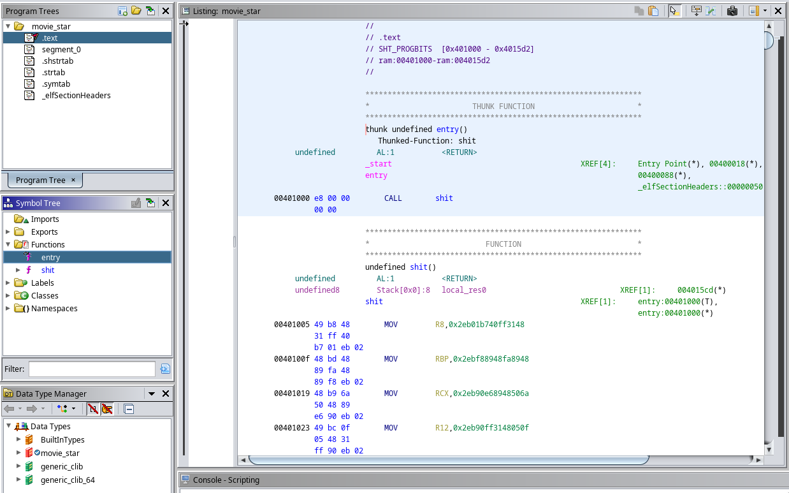

On remarque tout de suite que le binaire n'est pas normal, il n'y a pas de fonction main, seules deux fonctions sont présentes, pas d'import, pas de section plt/got.

Quand il n'y a pas de fonction main, le programme se lance par défaut dans la fonction ``entry``. Ici la fonction entry ne sert qu'à appeller la fonction``shit``

On ouvre donc la fonction shit:
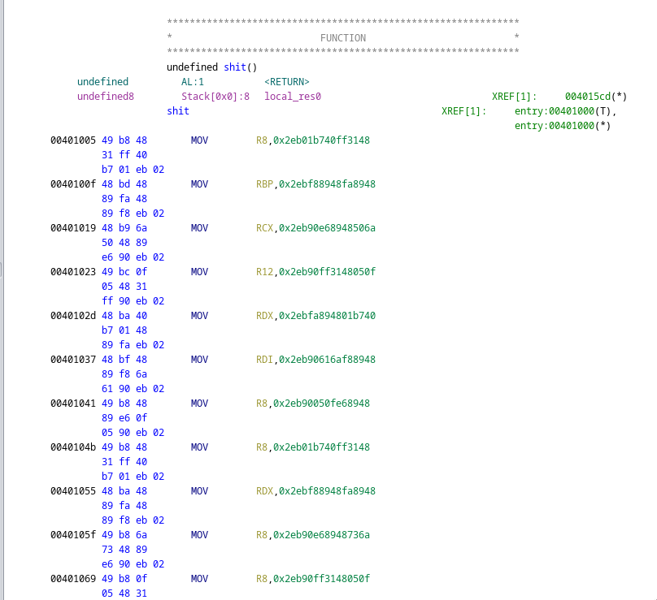

Eeet... on tombe sur une centaine de lignes similaires à celles-ci.
évidemment, c'est illisible et incompréhensible, donc mon premier réflexe a été d'abandonner l'analyse statique et de passer directement à l'analyse dynamique ( parce que je suspecte du code polymorphe, donc qui se modifie au runtime ).


## Analyse dynamique

Bon, on sait à peu près à quoi ressemble le programme grace à l'analyse statique, on a juste deux fonctions, et ``entry`` sert juste à call ``shit``.

On ouvre gdb, petit breakpoint à shit et on lance le tout. ( J'utilise le plugin [gef](https://github.com/hugsy/gef) )
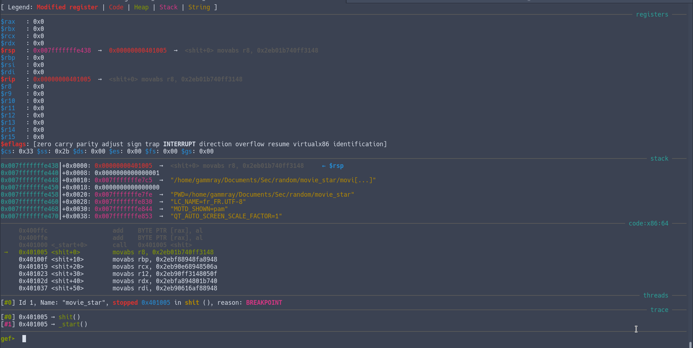

On retrouve toutes nos instructions ``movabs`` qu'on avait vues dans ghidra. A priori, ``movabs`` ça sert juste à déplacer des données, donc y'a forcément autre chose même si on le voit pas encore. Du coup, on spamme de ``ni`` pour aller jusqu'à la fin de la fonction.

Et là, magie, au moment du ret, au lieu de return dans entry et d'exit le programme, on retourne au début de shit, sauf que maintenant on a des instructions qu'on connaît !

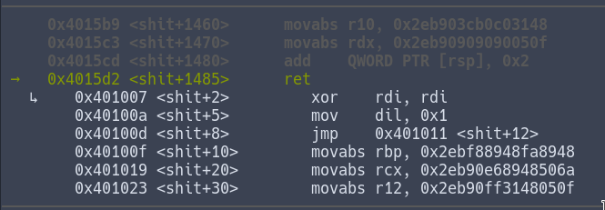

En continuant d'avancer dans le code, on voit que les registres sont changés et on finit par tomber sur une instruction syscall.
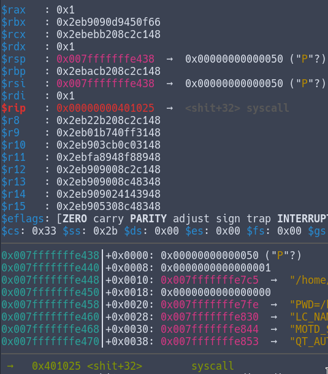

(Voici un [site](https://syscalls.w3challs.com/?arch=x86_64) super utile pour les syscalls, on peut voir quels registres sont utilisés pour faire quoi.)

Grace au site, on remarque rapidement que rax étant à 0x1, c'est un call de write qui va être effectué. Write prend 3 paramètres: le fichier dans lequel écrire, le pointeur vers la string et la taille de la string, qui sont respectivement les registres rdi, rsi et rdx.
 (Note : le "fichier" 1 représente stdout, 0 stdin et 2 stderr. Ici on write dans 0x1, donc dans stdout)

Toutes ces instructions pour au final simplement print "P" à l'écran.

Bon, en continuant d'avancer, on voit que petit à petit, le mot "Pass: " s'écrit à l'écran.

Une fois le mot finit d'écrire, un peu plus loin on appelle de nouveau syscall mais avec des registres différent:

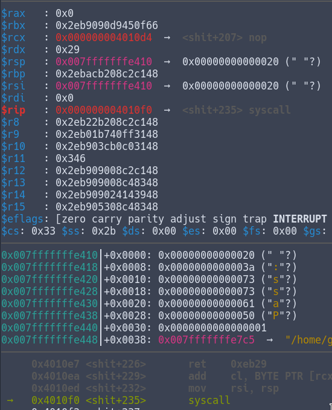

( Note : Sur l'image le registre rsi pointe vers le premier élément de la stack, c'est: " " parce que le dernier write effectué était pour print un espace )

rax est 0x0, c'est donc read qui est appellé cette fois. read prend aussi 3 paramètres, le fichier, le pointeur vers le buffer et la taille du buffer (et l'ordre des registres est le même rdi, rsi et rdx).
Vu que la taille du buffer est de 0x29 (41), on va rentrer cette string: "AAAAAAAABBBBBBBBCCCCCCCCDDDDDDDDEEEEEEEE" (\n est le 41ème caractère)

On continue encore d'avancer, et on remarque que les prochaines instructions changent petit à petit le registre rax:
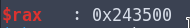


Une dizaine d'instructions plus tard, on voit une instruction très intéressante:
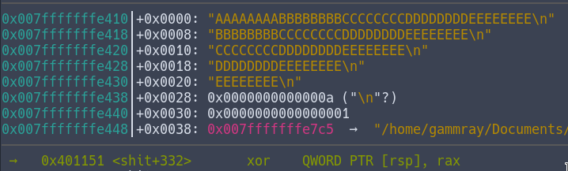

On utilise rax ( qui vaut maintenant 0x3546576879800a24 ) pour xorer les 8 premiers bytes de notre input ( les 8 premiers A ). L'instruction xor est une instruction in-place, ce qui veut dire que la valeur originale est remplacée par le résultat du xor. Notre chaine de caractère "AAA...EEEE" qui se trouve sur la stack est donc modifiée, et les 8 premiers caractères ne sont plus des A mais le résultat du xor.

La prochaine instruction est ``add rsp, 8``, rsp pointe donc désormais 8 bytes plus loin, donc sur le 1er "B" de notre input.

Ce processus est enchainé 5 fois, avec à chaque fois une valeur différente pour le xor. Voici la liste des valeurs utilisées:
<a name="xorlist"></a>
```
1x = 0x3546576879800a24
2x = 0x2536475869708a14
3x = 0x78563412abcdef90
4x = 0x1e2d3c4b5a69780f
5x = 0x96f5a4b3c2d1e087
```

Une fois nos 5 parties xorés, le code va remettre rsp à sa valeur initiale avec ``sub rsp, 0x28`` 0x28 = 40, rsp pointe donc à nouveau vers le début de notre input, sauf que notre input n'est plus "AAAAAAAABBBBBBBBCCCCCCCCDDDDDDDDEEEEEEEE", mais:

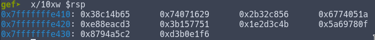

Avec notre input xorée, on peut logiquement déduire que la prochaine étape sera de comparer le résultat des xor avec une valeur attendue.
En avançant encore, on voit à nouveau le même procédé pour remplir rdx cette fois,

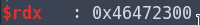
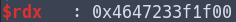

Et en effet, une fois rdx complet, on a bien notre instruction de comparaison qui apparait:
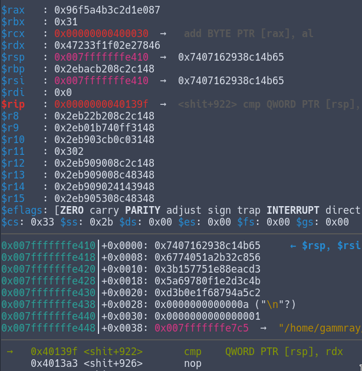

Ici, on va comparer les 8 premier bytes à l'adresse de rsp ( rsp qui pointe sur notre string xorée ) avec le rdx construit juste avant.
On a donc ``cmp 0x7407162938c14b65, 0x47233f1f02e27846``. Le test du flag est ici, pour réussir la comparaison, les 8 premiers caractères xorés ( avec le [premier xor](#xorlist) ) doivent être égaux à 0x47233f1f02e27846. Vu que c'est un simple xor, il est facile résoudre l'équation:

```
x ^ 0x3546576879800a24 = 0x47233f1f02e27846
0x3546576879800a24 ^ 0x47233f1f02e27846 = x
x = 0x726568777b627262
```

Et en ascii on a : ``0x726568777b627262 = rehw{brb``

On reconnait le format du flag ``brb{}`` donc on sait qu'on a bien la première partie du flag ! ( Les 8 premiers caractères )

( Note : le flag est inversé étant donné que les données en mémoire sont dans le format little endian, donc pour résumé, tout est inversé. De très bonnes ressources existent pour mieux comprendre [l'endianness](https://www.geeksforgeeks.org/little-and-big-endian-mystery/) )

Comme pour la liste des [xor](#xorlist) le même processus est repété 5 fois, donc au final on se retrouve avec une liste de valeurs:

```
1r = 0x47233f1f02e27846
2r = 0x4469222a0c07d571
3r = 0x1d255b7adf9283fc
4r = 0x7d584e3f29071150
5r = 0xebca9bc0acbe89f3
```

Et maintenant, avec la liste de [xor](#xorlist) et la liste de résultats attendu que l'on vient de récupérer, on a plus qu'à faire les opérations pour avoir le flag:

```
1r ^ 1x = 726568777b627262 = rehw{brb
2r ^ 2x = 615f657265775f65 = a_erew_e
3r ^ 3x = 65736f68745f6c6c = esoht_ll
4r ^ 4x = 63757274736e695f = curtsni_
5r ^ 5x = 7d3f3f736e6f6974 = }??snoit
```

```
}??snoitcurtsni_esoht_lla_erew_erehw{brb
brb{where_were_all_those_instructions??}
```
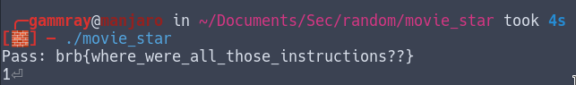

