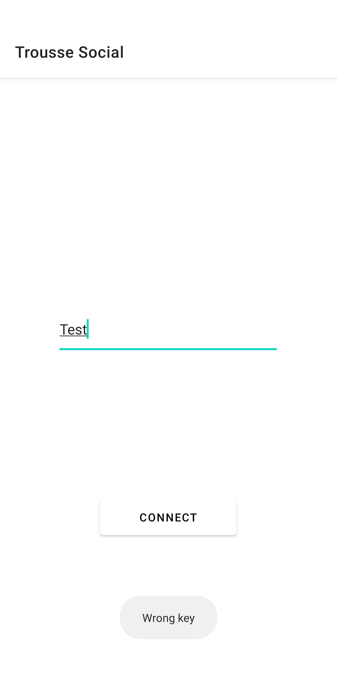
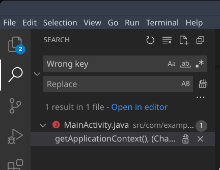

# Category : Android - Trousse Social

```
```

## Getting the source

After some research online, I came across this [git repo](https://github.com/TheZ3ro/apk2java-linux) that unpack and decompile apk to java code. After a quick install, we just have to run a simple python script:

``$ ./apk2java-linux/apk2java.py trousse_social.apk``

## Finding the code

If you launch the app on an emulator, and try to enter a key, a pop-up will spawn "Wrong Key".


We can now try to look for occurence of this string in all the files, using visual studio code, we get:


When we open `./src/com/example/troussesocial/MainActivity.java` we can now see the code behind the register button !

```java
public void onClick(View var1_1) {
    block4 : {
        var3_2 = String.valueOf((Object)((EditText)MainActivity.this.findViewById(2131230949)).getText());
        if (var3_2.length() != 12) ** GOTO lbl14
        var4_3 = new int[12];
        var1_1 = "";
        for (var2_4 = 0; var2_4 < var3_2.length(); var1_1 = var1_1.toString(), ++var2_4) {
    	    var1_1 = a.j((String)var1_1);
            var1_1.append((char)(var3_2.charAt(var2_4) ^ "IMTHEBOSS".charAt(var2_4 % 9)));
        }
        for (var2_4 = 0; var2_4 < var1_1.length(); ++var2_4) {
            var4_3[var2_4] = var1_1.charAt(var2_4) * 2 + 5;
        }
        for (var2_4 = 0; var2_4 < 12; ++var2_4) {
           if (var4_3[var2_4] == new int[]{35, 117, 51, 75, 57, 49, 117, 201, 83, 127, 257, 17}[var2_4]) continue;
lbl14: // 2 sources:
            var2_4 = 0;
            break block4;
        }
        var2_4 = 1;
    }
    if (var2_4 != 0) {
        MainActivity.this.setContentView(2131427356);
        return;
    }
    Toast.makeText((Context)MainActivity.this.getApplicationContext(), (CharSequence)"Wrong key", (int)0).show();
}
```

## Reversing the algorithm

As we look at the code, we see that the expected input is 12 characters long (`var3_2.length() != 12`)
We also notice that we are xoring the input with the key "IMTHEBOSS", and that a few lines down, for each characters in our now-xored input we do: ``char * 2 + 5``.
Finally, we are comparing the encrypted input with the list `int[]{35, 117, 51, 75, 57, 49, 117, 201, 83, 127, 257, 17}`

To finally solve it, we do a little bit of python:
```py
f = [35, 117, 51, 75, 57, 49, 117, 201, 83, 127, 257, 17]
x = ["I", "M", "T", "H", "E", "B", "O", "S", "S", "I", "M", "T"]

res = []
for letter, xored in zip(f, x):
	res.append(chr(((letter - 5) // 2) ^ ord(xored)))

print(''.join(res))
```
Result: `FuCk_Tw1tt3R`
