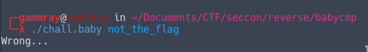
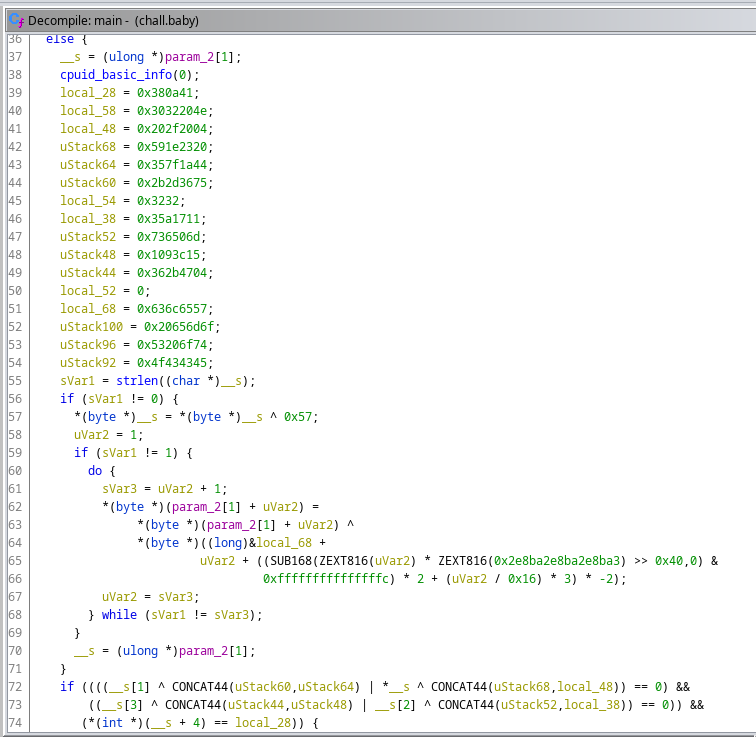
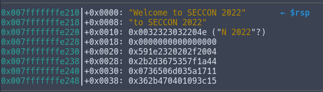
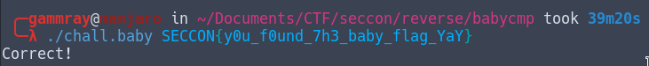

# Babycmp - reverse 

## Normal behaviour



## Static analysis

Opening the main function of the binary with ghidra, the decompiler gives us this code :  



After analysing the hard coded hex values, i recognise ASCII characters that forms the string (data was in little endian) : "Welcome to SECCON 2022"
```
    local_68 = 0x636c6557;
    uStack100 = 0x20656d6f;
    uStack96 = 0x53206f74;
    uStack92 = 0x4f434345;
    local_58 = 0x3032204e;
    local_54 = 0x3232;
```

I quickly gave up on static analysis when seeing the rest of the code, it seemed to be a bit of a mess, so i directly switched to dynamic analysis.

## Dynamic analysis

After skipping the test for the argument (len argv > 1), we see again the variables that we found earlier forming a string.



Stepping in the code, i see an interesting instruction ``xor    BYTE PTR [r12],0x57`` (r12 contains our input). Please note that 0x57 is the ASCII code of the letter "W"... the first letter of the string "Welcome to SECCON 2022". Noticing that makes the rest pretty easy, we have a loop that xor every letter of the input with the corresponding index of our string welcome.

```
Notice : The loop has some obfuscation to it, but it's not hard to understand that it simply xor our input by looking at the modification of the register during the loop.
```

So, in reality, our loop looks like this:

```py
xor_str = "Welcome to SECCON 2022"
for i = 0; i < input.length; i++; {
	input[i] = input[i] ^ xor_str[i%xor_str.length]
}
```

Once the loop is completed and our input has been xored, we have the interesting part the comparaisons !

The first comparaison is (r12 is input) :

```nasm
 → 0x55555555525b <main+219>       mov    rax, QWORD PTR [r12]
   0x55555555525f <main+223>       mov    rdx, QWORD PTR [r12+0x8]
   0x555555555264 <main+228>       xor    rax, QWORD PTR [rsp+0x20]
   0x555555555269 <main+233>       xor    rdx, QWORD PTR [rsp+0x28]
   0x55555555526e <main+238>       or     rdx, rax
   0x555555555271 <main+241>       je     0x55555555529e <main+286>
```

(Our stack looks like this:)
```
0x007fffffffe210│+0x0000: "Welcome to SECCON 2022"	 ← $rsp
0x007fffffffe218│+0x0008: "to SECCON 2022"
0x007fffffffe220│+0x0010: 0x0032323032204e ("N 2022"?)
0x007fffffffe228│+0x0018: 0x0000000000000000
0x007fffffffe230│+0x0020: 0x591e2320202f2004
0x007fffffffe238│+0x0028: 0x2b2d3675357f1a44
0x007fffffffe240│+0x0030: 0x0736506d035a1711
0x007fffffffe248│+0x0038: 0x362b470401093c15
```

So, we are xoring the first 8 bytes of our input (QWORD PTR [r12]) with 8 bytes in the stack (QWORD PTR [rsp+0x20]), and xoring the next 8 bytes of our input with the next 8 bytes of the stack.  
We then are doing the ``or`` operation on both of our xor data, and expect a result of 0.  

This is enough for us to reverse the operation in order to find the correct bytes.

(Note : `0x591e2320202f2004` is stored as little endian in the stack, so we need to convert it to big endian before using it)
```
    (input[:8] ^ xor_str[:8]) ^ 0x04202F2020231E59 == 0
=>  input[:8] ^ "Welcome " == 0x04202F2020231E59
=>  "Welcome " ^ 0x04202F2020231E59 == input[:8]
=>  0x57656C636F6D6520 ^ 0x04202F2020231E59 = 0x534543434F4E7B79
=>  input[:8] = "SECCON{y"
```

And like this we have our first 8 bytes ! We now can do the same for the next 8 bytes:

```
    xor_str+0x8 = "to SECCO"
=>  0x746F20534543434F ^ 0x441A7F3575362D2B = 0x30755F6630756E64
=>  input+0x8 = "0u_f0und"
```

We can now do the same for the next comparaison that comes just after the jmp in the code:

```nasm
   0x000055555555529e <+286>:	mov    rax,QWORD PTR [r12+0x10]
   0x00005555555552a3 <+291>:	mov    rdx,QWORD PTR [r12+0x18]
   0x00005555555552a8 <+296>:	xor    rax,QWORD PTR [rsp+0x30]
   0x00005555555552ad <+301>:	xor    rdx,QWORD PTR [rsp+0x38]
   0x00005555555552b2 <+306>:	or     rdx,rax
   0x00005555555552b5 <+309>:	jne    0x555555555273 <main+243>
```

```
    xor_str+0x10 = "N 2022We"
=>  0x4E20323032325765 ^ 0x11175A036D503607 = 0x5F3768335F626162
=>  input+0x10 = "_7h3_bab"

    xor_str+0x18 = "lcome to"
=>  0x6C636F6D6520746F ^ 0x153C090104472B36 = 0x795F666C61675F59
=>  input+0x18 = "y_flag_Y"
```

And finally, after this jump, we have the last comparaison:

```nasm
   0x00005555555552b7 <+311>:	mov    eax,DWORD PTR [rsp+0x40]
   0x00005555555552bb <+315>:	cmp    DWORD PTR [r12+0x20],eax
   0x00005555555552c0 <+320>:	jne    0x555555555273 <main+243>
```

```
     xor_str = " SE"
=>   0x205345 ^ 0x410A38
=>   input+0x20 = "aY}"
```

The completed flag is : `SECCON{y0u_f0und_7h3_baby_flag_YaY}`


