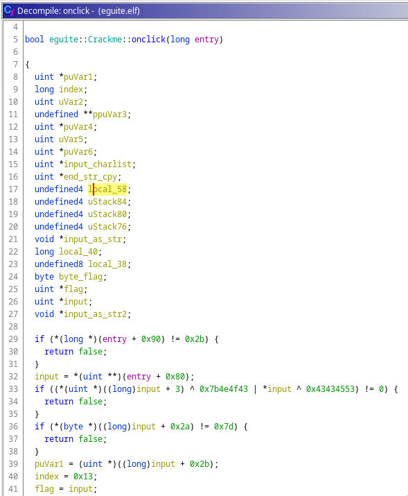
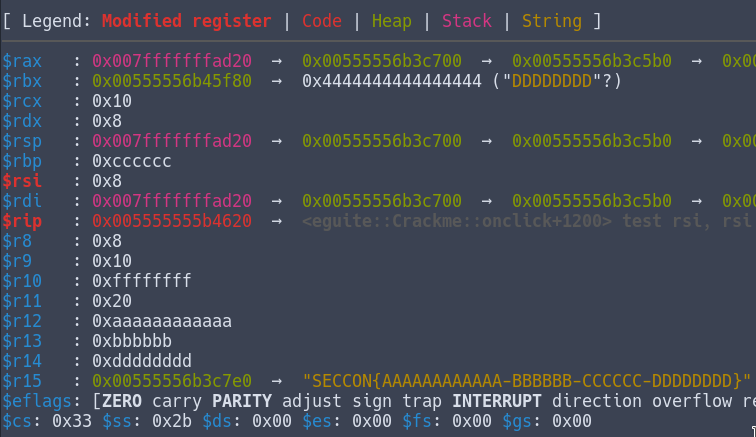
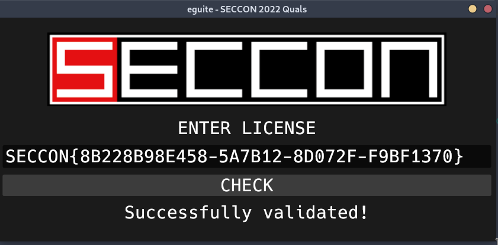

# Eguite - reverse 

eguite.elf is a rust graphical application (coded with the library "egui"), checking for a specific license.

## Static analysis

Opening the binary in ghidra, we quickly see that it's gonna be a mess finding our code amount all the boilerplate/graphical stuff.  
I first tried looking for string in the binary like "license", "check", "SECCON", but nothing looked interesting. I the tried to find specific functions name in the symbol tree in ghidra (thankfully the binary was not stripped) and found something really interesting when searching "click": a function named `_ZN6eguite7Crackme7onclick17ha26112793d42c9d8E`  
With no surprise, the code checking the license seems to be here. (some variables in the screenshot have been renamed)



The first if checks that the value at `param+0x90` is 0x2b (43). I guessed that it probably is the length of the license, if it's not the correct length it would return false without any more execution. This guess has been confirmed later during the dynamic analysis.  

Now the next few lines of code are interesting and confirms that we are indeed at the right place:
```c
  input = *(uint **)(entry + 0x80);
  if ((*(uint *)((long)input + 3) ^ 0x7b4e4f43 | *input ^ 0x43434553) != 0) {
    return false;
  }
  if (*(byte *)((long)input + 0x2a) != 0x7d) {
    return false;
  }
```

Here we see some ASCII chars: 0x7b4e4f43 = "{NOC" and 0x43434553 = "CCES". Those are "SECCON{" stored in little endian.  
So we now know that `entry+0x80` is the adress pointing to our raw string input and the first 7 letters should be "SECCON{".  
**Note**: Dereferencing input+3 means that instead of "HELLO_WORLD", we have "LO_WORLD" and since it's stored as a DWORD (the uint in the decompiled code) , we have only 4 bytes, so "LO_W". If we used "SECCON{TEST}" as input, we would have `input+3 = "CON{"` (wich is "{NOC" in little endian).

On the next if, we are testing that the byte at index 0x2a (42) is equal to "}" wich is the end of the flag.

Seing the rest of the function that seems to be pretty hard to understand, I switched to dynamic analysis.

## Dynamic analysis

Placing a breakpoint on `_ZN6eguite7Crackme7onclick17ha26112793d42c9d8E` and entering some junk flag in the application, we can access the code of the function.  
We can skip the test for the length, we know what it's doing
```nasm
   0x00005555555b417e <+14>:	cmp    QWORD PTR [rdi+0x90],0x2b
   0x00005555555b4186 <+22>:	jne    0x5555555b44d9 <_ZN6eguite7Crackme7onclick17ha26112793d42c9d8E+873>
```

And just after that, we see our 2 ifs that check the flag format
```nasm
   0x00005555555b418c <+28>:	mov    r15,QWORD PTR [rdi+0x80]
   0x00005555555b4193 <+35>:	mov    eax,0x43434553
   0x00005555555b4198 <+40>:	xor    eax,DWORD PTR [r15]
   0x00005555555b419b <+43>:	mov    ecx,0x7b4e4f43
   0x00005555555b41a0 <+48>:	xor    ecx,DWORD PTR [r15+0x3]
   0x00005555555b41a4 <+52>:	or     ecx,eax
   0x00005555555b41a6 <+54>:	jne    0x5555555b44d9 <_ZN6eguite7Crackme7onclick17ha26112793d42c9d8E+873>
   0x00005555555b41ac <+60>:	cmp    BYTE PTR [r15+0x2a],0x7d
   0x00005555555b41b1 <+65>:	jne    0x5555555b44d9 <_ZN6eguite7Crackme7onclick17ha26112793d42c9d8E+873>
```

We easily confirm the guess we made during the static analysis simply by looking at our registers here.  

For the next part, we recognize a loop that uses ecx as index, starting from 0x13 to 0.
```nasm
   0x00005555555b41d0 <+96>:	add    rax,0x1
=> 0x00005555555b41d4 <+100>:	add    rcx,0xffffffffffffffff
   0x00005555555b41d8 <+104>:	je     0x5555555b4235 <_ZN6eguite7Crackme7onclick[...]+197>  # Exit Loop
   0x00005555555b41da <+106>:	cmp    rax,rbx
   0x00005555555b41dd <+109>:	je     0x5555555b427f <_ZN6eguite7Crackme7onclick[...]+271>  # Return False
   0x00005555555b41e3 <+115>:	movzx  edx,BYTE PTR [rax]
   0x00005555555b41e6 <+118>:	test   dl,dl
   0x00005555555b41e8 <+120>:	jns    0x5555555b41d0 <_ZN6eguite7Crackme7onclick[...]+96>   # Continue Loop
```

The only thing that this loop does, is removing $ecx bytes from the start of the input.  
So before the loop, ``rax = "SECCON{123456789abcdef...}"``  
And after the loop, ``rax = rax+0x13 (19) = "def...}"``

Once out of the loop, the code will check that `BYTE PTR [rax] == 0x2d`, 0x2d being "-", we know that at index 19, there is a "-".

This loop+checking for "-" is done 3 times and gives us a pattern for our flag:  
`flag[19] = "-"`  
`flag[26] = "-"`  
`flag[33] = "-"`  
`SECCON{AAAAAAAAAAAA-BBBBBB-CCCCCC-DDDDDDDD}`


### Now for the hard part!

We now enter the part where our kinda sanitized input will be checked with the actual flag. The issue here, is that the code is using some rust functions and I had to understand what they were doing first.  

Continuing in the function, we see a call to `_ZN95_$LT$alloc..string..String$u20$as$u20$core..iter..traits..collect..FromIterator$LT$char$GT$$GT$9from_iter17h6979761c404513e0E`... Yeah that's a long name, but we can find some interesting words, "alloc" "String" "iter" "FromIterator" "char".  
And looking at the registers after the call, i see in the stack "AAAAAAAAAAAA", at this point my input being "SECCON{AAAAAAAAAAAA-BBBBBB-CCCCCC-DDDDDDDD}", it seems that this function call splitted our flag and retrieved the first part, "AAAAAAAAAAAA".  
A few instruction later, we have again a call to a function, this time it's `_ZN4core3num14from_str_radix17h893e9e49eefa3035E`. Asking google what "rust from_str_radix" is, I understood that this was to transform our input (string) into an int in a certain base. (We dont really care wich base since it's stored as hex anyway)  

Alright so, we split our flag, get the first part and stores it as an integer. We can see that we are right by looking at the stack:
```
0x007fffffffad28│+0x0008: 0x0000aaaaaaaaaaaa
```

This is done for every other part of the flag, and here's the state of our register:



r12, r13, rbp and r14 stores the 4 parts of our input.  
A few instructions later, we found what we are looking for, actual comparaisons !

(asm is simplified)
```nasm
 → 0x5555555b4633 <eguite::Crackme::onclick+1219> lea    rcx, [r12+r13*1]
   0x5555555b4639 <eguite::Crackme::onclick+1225> cmp    rcx, 0x8b228bf35f6a
   [...]
   0x5555555b464c <eguite::Crackme::onclick+1244> mov    rcx, rbp
   0x5555555b464f <eguite::Crackme::onclick+1247> add    rcx, r13
   0x5555555b4652 <eguite::Crackme::onclick+1250> cmp    rcx, 0xe78241
   [...]
   0x5555555b4664 <eguite::Crackme::onclick+1268> lea    rcx, [r14+rbp*1]
   0x5555555b465f <eguite::Crackme::onclick+1263> mov    rsi, 0xfa4c1a9f
   0x5555555b466f <eguite::Crackme::onclick+1279> cmp    rcx, rsi
   [...]
   0x5555555b4678 <eguite::Crackme::onclick+1288> add    r12, r14
   0x5555555b467b <eguite::Crackme::onclick+1291> cmp    r12, 0x8b238557f7c8
   [...]
   0x5555555b468e <eguite::Crackme::onclick+1310> xor    rbp, r13
   0x5555555b4691 <eguite::Crackme::onclick+1313> xor    rbp, r14
   0x5555555b4694 <eguite::Crackme::onclick+1316> cmp    rbp, 0xf9686f4d
```

So! The correct flag need to respect those equations:
```
r12 + r13 == 0x8b228bf35f6a
rbp + r13 == 0xe78241
r14 + rbo == 0xfa4c1a9f
r12 + r14 == 0x8b238557f7c8
rbp ^ r13 ^ r14 == 0xf9686f4d
```

Using [this script](./solver.py) i was able to solve this and retrieve the correct flag: `SECCON{8B228B98E458-5A7B12-8D072F-F9BF1370}`  

